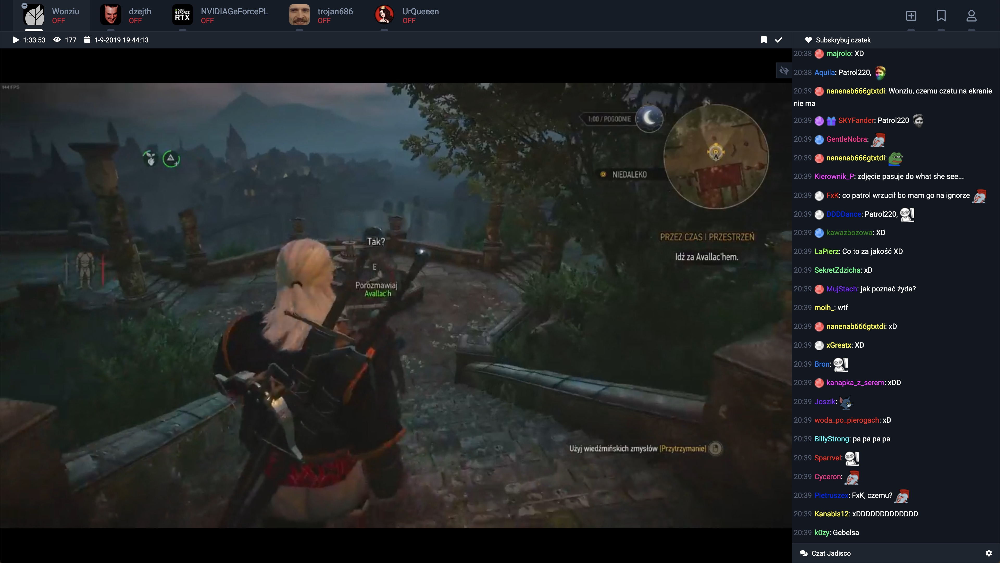

# PoorchatBot

[Online](https://jarchiwum.pl/wonziu/2335317636517962?platform=facebook) 

## What is this all about?

IRC Bot which listen users messages and saved them in the mongo database, so later on, after live stream is over, users can watch the live chat replay. It can also send messages.

It's based on websocket which sends IRC like events whenever user post new message, join chanel etc. Right now it's only sync to facebook player.

Main goal was to start saving messages every time a stream starts, and stop when it's finished, but jadisco.pl notifier right now has some issues with facebook API, so bot is running 24/7.

## What I use?
App is build with:
* [NodeJS](https://nodejs.org/en/) 
* [MongoDB](https://www.mongodb.com/) 
* [AWS](https://aws.amazon.com/) 

## Installation
You can just clone repository files and run to install all dependencies:

`npm install`

After that just run to start server:

`npm run dev`

If you would like to make it work, yo will also need to fill *config-sample.josn* file with your data, and then remove *-sample* from file name.

*All project files are located in ./src/*